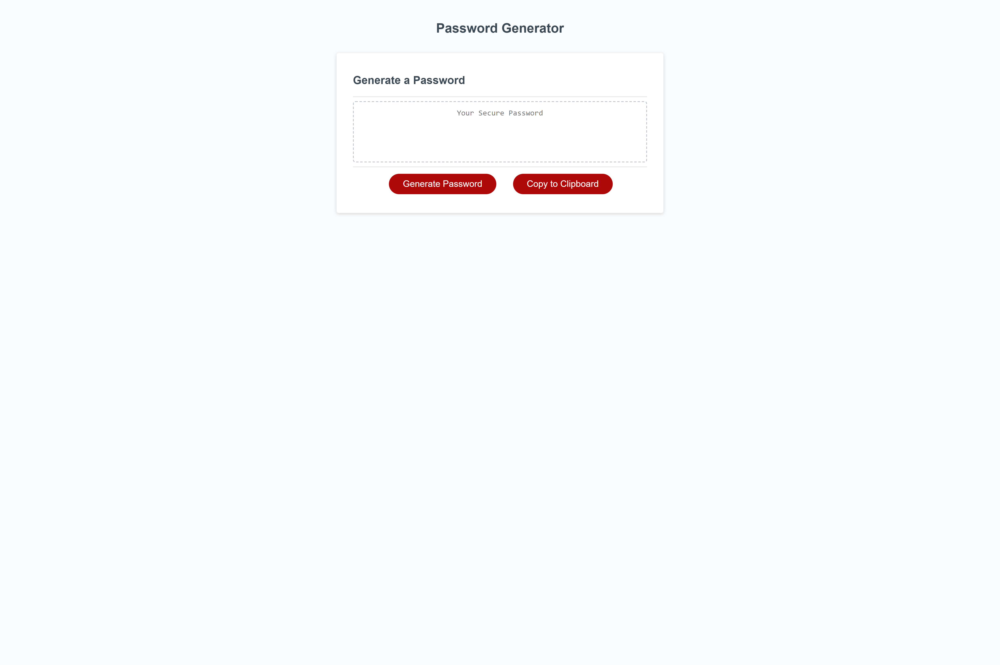

# Password Generator

## Description 

- The motivation behind this project was to apply JavaScript concepts learned in class by creating a password generator that requires employees to generate a random password. 
- This project was built to modify starter code to create an application that enables employees to generate random passwords based on criteria that they’ve selected. 
- This project helps emplpyee select a safe and secured password.
- During this project I learned how to creat and run a dynamical updated HTML and CSS powered by JavaScript code that is clean and polished, responsive user interface that adapts to multiple screen sizes.

## User Story

```
AS AN employee with access to sensitive data
I WANT to randomly generate a password that meets certain criteria
SO THAT I can create a strong passsword that provides greater security
```

## Acceptance Criteria

```
GIVEN I need a new, secure password
WHEN I click the button to generate a password
THEN I am presented with a series of prompts for password criteria
WHEN prompted for password criteria
THEN I select which criteria to include in the password
WHEN prompted for the length of the password
THEN I choose a length of at least 8 characters and no more than 128 characters
WHEN asked for character types to include in the password
THEN I confirm whether or not to include lowercase, uppercase, numeric, and/or special characters
WHEN I answer each prompt
THEN my input should be validated and at least one character type should be selected
WHEN all prompts are answered
THEN a password is generated that matches the selected criteria
WHEN the password is generated
THEN the password is either displayed in an alert or written to the page
```

## Link To Deployed Application 

https://eugeneisingizwe.github.io/Password-Generator/

## Mock-Up





- - -
© 2022 Trilogy Education Services, LLC, a 2U, Inc. brand. Confidential and Proprietary. All Rights Reserved.