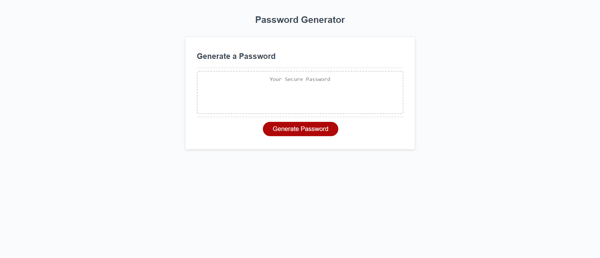

# Password Generator

## Description 

- The motivation behind this project was to apply JavaScript concepts learned in class by creating a password generator that requires employees to generate a random password. 
- This project was built to modify starter code to create an application that enables employees to generate random passwords based on criteria that they’ve selected. 
- This project helps emplpyee select a safe and secured password.
- During this project I learned how to creat and run a dynamical updated HTML and CSS powered by JavaScript code that is clean and polished, responsive user interface that adapts to multiple screen sizes.

## Link To Deployed Application 

https://eugeneisingizwe.github.io/Password-Generator/

## Mock-Up

- - -
© 2022 Trilogy Education Services, LLC, a 2U, Inc. brand. Confidential and Proprietary. All Rights Reserved.